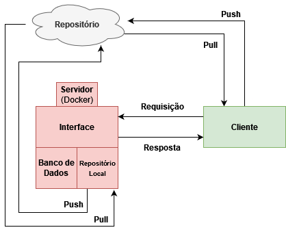

# PETWiki

## Visão geral

Wiki.js é uma estrutura genérica para a criação de sistemas de gestão de conteúdo em forma `wiki`. Através de linguagens de marcação, vários usuários podem modificar ou editar colaborativamente conteúdo do `wiki` usando um navegador web ou com a ajuda de um editor de texto.



Este é um guia rápido e simples para executar o Wiki.js em sua máquina **macOS** ou **Windows** local.

## Instalação

### 1. Instale o Docker Desktop

Instale o Docker Desktop que inclui o Docker e o Docker Compose:

- [macOS (Apple Silicon)](https://desktop.docker.com/mac/main/arm64/Docker.dmg)
- [macOS (Intel)](https://desktop.docker.com/mac/main/amd64/Docker.dmg)
- [Windows](https://desktop.docker.com/win/main/amd64/Docker%20Desktop%20Installer.exe)

### 2. Crie a pasta de instalação

Crie uma nova pasta chamada `wiki` no local de sua escolha.

Dentro desta pasta, crie um novo arquivo chamado `docker-compose.yaml` e cole o seguinte conteúdo dentro:

```yaml
version: "3"
services:

  db:
    image: postgres:15-alpine
    environment:
      POSTGRES_DB: wiki
      POSTGRES_PASSWORD: wikijsrocks
      POSTGRES_USER: wikijs
    logging:
      driver: "none"
    restart: unless-stopped
    volumes:
      - db-data:/var/lib/postgresql/data

  wiki:
    image: ghcr.io/requarks/wiki:2
    depends_on:
      - db
    environment:
      DB_TYPE: postgres
      DB_HOST: db
      DB_PORT: 5432
      DB_USER: wikijs
      DB_PASS: wikijsrocks
      DB_NAME: wiki
    restart: unless-stopped
    ports:
      - "80:3000"

volumes:
  db-data:
```

Este arquivo simplesmente define um contêiner PostgreSQL *(nosso banco de dados)* e o contêiner Wiki.js.

### 3. Abra o Terminal/Prompt de Comando

No **macOS**, inicie o **Terminal** e navegue até a pasta `wiki` que você criou anteriormente.

No **Windows**, abra a pasta `wiki` que você criou anteriormente no **File Explorer**.
Na barra de endereço, digite `cmd` e pressione <kbd>ENTER</kbd> para iniciar um **Prompt de comando** nesse local.

### 4. Inicie Wiki.js

Digite o seguinte comando no **Terminal** / **Prompt de comando** para iniciar o Wiki.js:

```sh
docker compose up -d
```

### 5. Navegue até Wiki.js

Abra seu navegador em http://localhost para concluir a instalação e usar o Wiki.js!

---

## Instalação definitiva em docker container

[Documentação oficial](https://docs.requarks.io/install/docker)